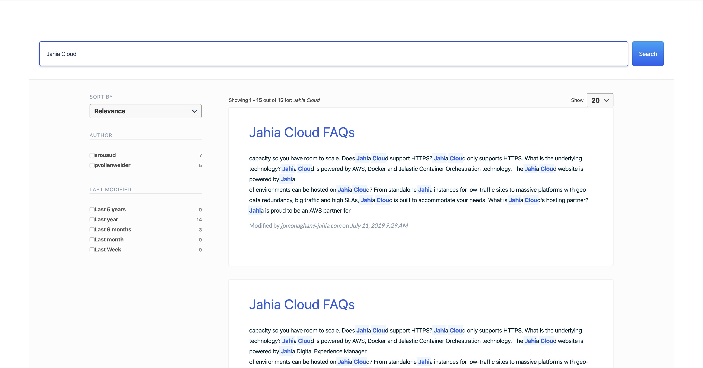

<a href="https://www.jahia.com/">
    
</a>

# Augmented Search UI

<p align="center">This repository is a sample UI module to integrate Jahia Augmented Search in your site. You can use it as the starting point to customize your search experience.</p>



This module is fully functional and available as is on the [Jahia App Store](https://store.jahia.com/contents/modules-repository/org/jahia/modules/augmented-search-ui.html)

## Table of content

- [Presentation](#presentation)
- [Development](#development)
- [Production](#production)

## Presentation

This module provides an easy way to quickly integrate Augmented Search in your project and provides a reference implementation to base your integration upon.

You can find more details on how to integrate this module in your site on [Jahia Academy](https://academy.jahia.com/documentation/developer#augmented-search).

If you want to customize the module, more details about our GraphQL API for augmented search is [available here](https://academy.jahia.com/documentation/developer/augmented-search/2.1/querying/writing-a-query#top).

Augmented Search is available on [Jahia App Store](https://store.jahia.com/contents/modules-repository/packages/Augmented%20Search.html)

## Development

This module is a [Jahia JavaScript module](https://academy.jahia.com/documentation/jahia-cms/jahia-8.2/developer/javascript-module-development):
it is built with [Vite](https://vite.dev/) and needs neither Maven nor a JDK.

### Getting set up

Local development requires **Docker** (Compose v2), **[mise](https://mise.jdx.dev/)**, and a **Jahia license** carrying the Augmented Search entitlement.

```bash
mise install
cp .env.example .env
# then add your base64-encoded license
mise start

# Either start the dev loop or run the test suite
mise dev
mise test
```

You'll find more details about the local stack and troobleshooting in [`dev/README.md`](dev/README.md).
